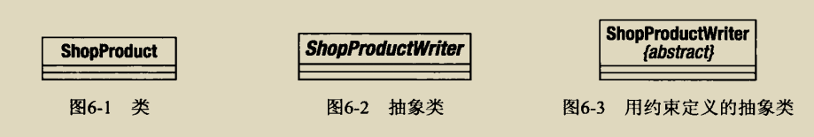
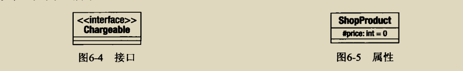
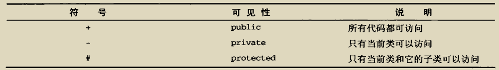
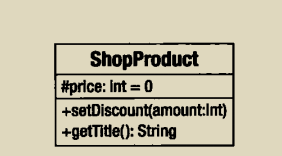
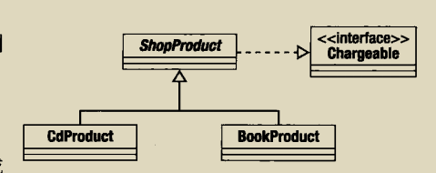
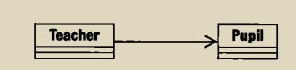
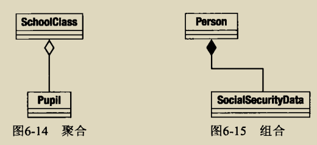
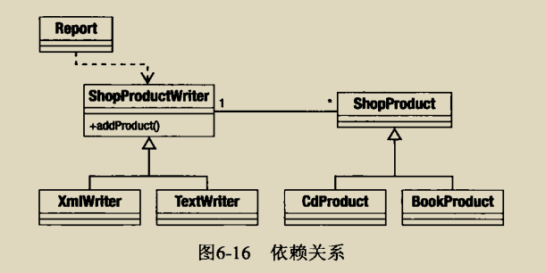
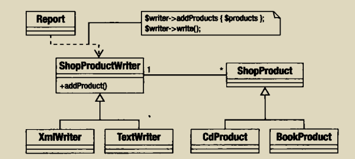

# pattern
使用php实现常见的设计模式，包括模式使用的场景以及模式的具体实现

# 什么是设计模式

设计模式是分析过的问题和问题解决方案所阐述的优秀实践

 # 为什么使用设计模式

- 一个设计模式定义了一个解决方案
- 设计模式是语言无关的
- 模式定义了一组词汇，方便技术人员沟通交流，解决问题，就像协议一样
- 模式是经过测试的
- 模式是协作而设计的，也像网络协议一样，定义一种通讯方式，解决某种问题，方便协作
- 模式促进良好设计，有助于我们写出扩展性，便于协作的代码

# 如何学习设计模式
 
 我发现现在很多博客都是各种语言的对设计模式的实现，其实设计模式的重点在于对某种类型的问题的分析和解决，所以我们应该弄清楚某种设计模式解决了什么问题，以及怎么实现来学习。此外，我们还需要学习一个简单的工具--uml图，辅助我们记忆与直观理解代码结构
 
# UML的使用
 
 ## 类图
  - 1.描述类

    

  - 2.属性

    

    属性的可见性描述：

    

  - 3.操作（方法）

    
  
  - 4.继承和实现
    
    继承：
    
    
    
    实现：
    
    
    
  - 5.关联
    当一个类的属性保存了对了另一个类的一个实例的应用时，就产生了管理连
   
    单向关联：
   
    
    
    双向关联以及多个引用:
    
    
  
  - 6.聚合和组合
  
    聚合和组合都描述了一个类长期持有其他类的一个或多个实例的情况，通过聚合和组合，被引用的对象实例成为引用对象的一部分
    
    在聚合的情况下，被包含对象是容器的一个核心部分，但是可以同时被其他对象所包含
    
    组合则是一个更强的关系，在组合中，被包含对象只能被它的容器所引用，当容器被删除时候，它也应该被删除
    
    
    
  - 7.描述使用
  
    一个对象使用另一个对象的关系在UML中被描述为一个依赖关系，这是最短暂的一种关系，因为它并非描述类之间的长久关系，一个被使用的类可以作为类方法的参数传递或者方法调用的结果得到
    
    
    
  - 8.使用注解
  
    注解可以补充说明类的具体实现
    
    
   
 # 模式设计的原则 
 - 组合与继承
 - 解耦
 - 面向接口编程
 - 组合优于继承
 - 把变化的概念封装起来
     
 # 目录
 设计模式主要分为一下几类
 
 ## 生成对象的设计模式
 
- [单例](单例模式/单例.md)
- [工厂方法模式](工厂方法模式/工厂方法模式.md)
- [抽象工厂模式](抽象工厂模式/抽象工厂模式.md)
    
 ## 让面向对象更加灵活的设计模式
 
- [组合模式](组合模式/组合模式.md)
- [装饰模式](装饰模式/装饰模式.md)
- [外观模式](外观模式/外观模式.md)
    
 ## 执行及描述任务
    - [策略模式]()
    - [观察者模式]()
    - [访问者模式]()
    - [命令模式]()
    - [解释器模式]()
    
  ## 企业模式
  
  ## 数据库模式
    
