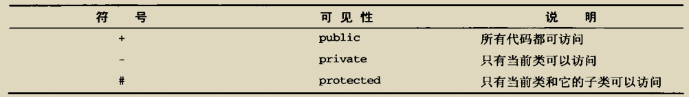
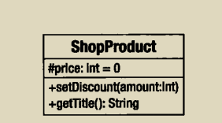
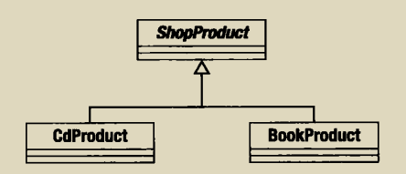
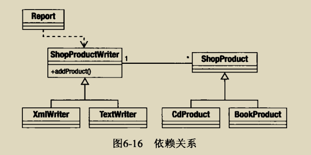

# 类图
  - 1.描述类

    

  - 2.属性

    

    属性的可见性描述：

    

  - 3.操作（方法）

    
  
  - 4.继承和实现
    
    继承：
    
    
    
    实现：
    
    
    
  - 5.关联
    当一个类的属性保存了对了另一个类的一个实例的应用时，就产生了管理连
   
    单向关联：
   
    
    
    双向关联以及多个引用:
    
    
  
  - 6.聚合和组合
  
    聚合和组合都描述了一个类长期持有其他类的一个或多个实例的情况，通过聚合和组合，被引用的对象实例成为引用对象的一部分
    
    在聚合的情况下，被包含对象是容器的一个核心部分，但是可以同时被其他对象所包含
    
    组合则是一个更强的关系，在组合中，被包含对象只能被它的容器所引用，当容器被删除时候，它也应该被删除
    
    
    
  - 7.描述使用
  
    一个对象使用另一个对象的关系在UML中被描述为一个依赖关系，这是最短暂的一种关系，因为它并非描述类之间的长久关系，一个被使用的类可以作为类方法的参数传递或者方法调用的结果得到
    
    
    
  - 8.使用注解
  
    注解可以补充说明类的具体实现
    
    