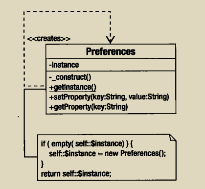

单例模式使用场景:

- 对象可以被系统的任何对象使用
- 对象不应该被存储在会被覆盖重写的全局变量中
- 系统中只允许只有一个对象



代码实现:

```php
class Preferences {
    private $props = [];

    private static $instance;

    private function __construct()
    {
    }

    public static function getInstance()
    {
        if (empty(self::$instance)){
            self::$instance = new Preferences();
        }
        return self::$instance;
    }

    public function setProperty($key,$val)
    {
        $this->props[$key] = $val;
    }

    public function getProperty($key)
    {
        return $this->props[$key];
    }
}
```
