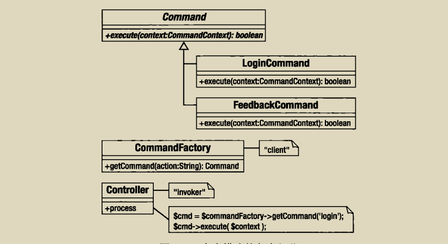

# 命令模式
命令模式可以帮助我们建立一个具有扩展性的多层系统，假设，有一个很多任务要执行的项目，需要允许某些用户登录，某些用户可以提交反馈，我们分别创建login.php和feedback.php页面来处理这些任务，并实例化专门的类以完成任务，不过遗憾的是，系统中的用户界面很难被精确地一一对应到系统任务，比如我们可能要求每个页面都有登陆和反馈的功能，如果页面必须处理很多不同的任务，就应该考虑将任务进行封装，封装之后，向系统增加新任务就会变得简单，并且可以将系统中的各部分分离开来，这时候我们就可以使用命令模式。



具体代码实现如下:

```php

abstract class Command {
    abstract function execute(CommandContext $context);
}

class LoginCommand extends Command {
    function execute(CommandContext $context)
    {
        $manger = Registry::getAccessManger();
        $user = $context->get('username');
        $pass = $context->get('pass');

        $userobj = $manger->login($user,$pass);
        if (is_null($userobj)) {
            $context->setError($manger->getError);
            return false;
        }
        $context->addParam("user",$userobj);

        return true;
    }

}

class CommandContext {
    private $params = [];
    private $error = "";

    function __construct()
    {
        $this->params = $_REQUEST;
    }

    function addParam($key,$val) {
        $this->params[$key] = $val;
    }

    function get($key) {
        return $this->params[$key];
    }

    function setError($error) {
        $this->error = $error;
    }

    function getError(){
        return $this->error;
    }
}

class CommandNotFoundException extends Exception {}

class CommandFactory {
    private static $dir = 'command';

    static function getCommand($action='default') {
        if (preg_match('/\W/',$action)) {
            throw new Exception('illegal characters in action');
        }
        $class =UCFirst(strtolower($action))."Command";
        $file = self::$dir.DIRECTORY_SEPARATOR."{$class}.php";

        if (!file_exists($file)){
            throw new CommandNotFoundException("could not find $file");
        }

        require_once($file);
        if (!class_exists($class)) {
            throw new CommandNotFoundException("no $class class located");
        }

        $cmd = new $class();

        return $cmd;
    }
}

class Controller {
    private $context;

    function __construct()
    {
        $this->context = new CommandContext();
    }

    function getContext() {
        return $this->context;
    }

    function process() {
        $cmd = CommandFactory::getCommand($this->context->get('action'));
        if (!$cmd->execute($this->context)){
            //处理失败
        }else{
            //成功
            //现在分发视图
        }
    }
}

//调用
$controller =new Controller();

//伪造用户请求

$context = $controller->getContext();
$context->addParam('action','login');
$context->addParam('username','seven');
$context->addParam('pass','tiddles');
$controller->process();

```