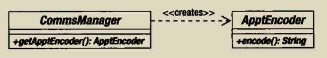
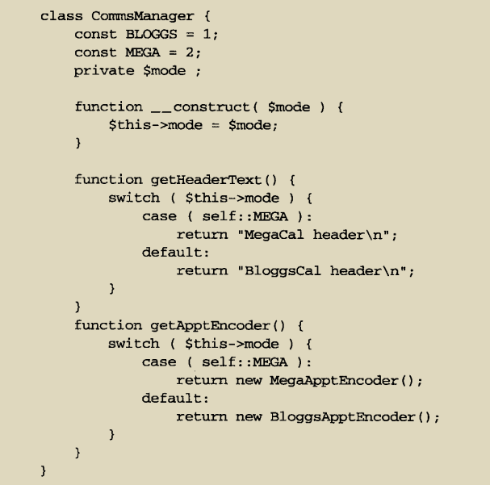
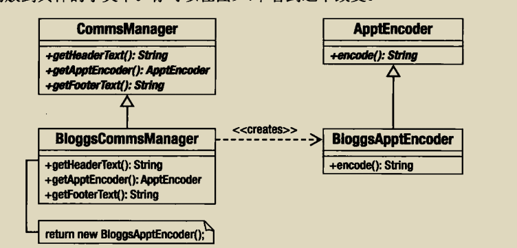
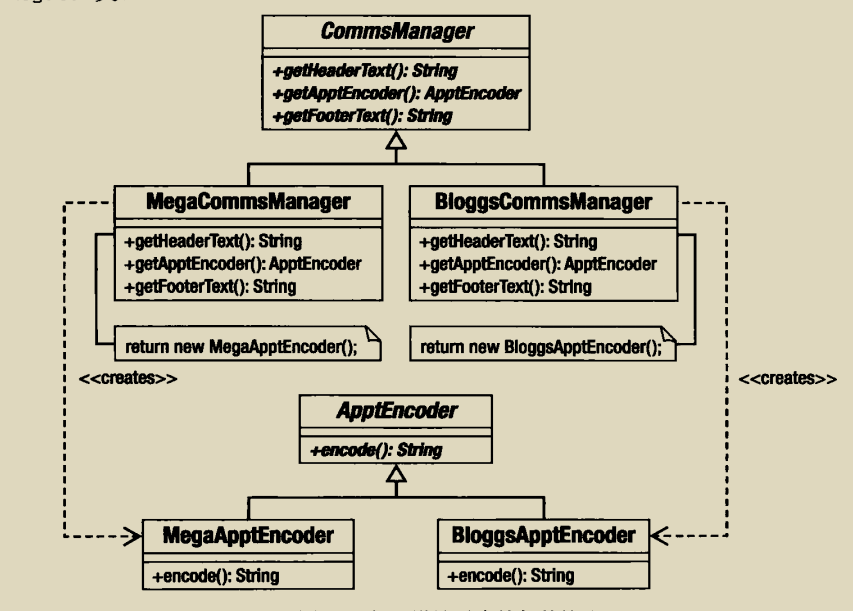

假设一个场景,有一个关于个人事务管理的项目，其功能之一是管理Appointment对象，我们的业务团队和另外一个公司建立了关系，目前需要用一个叫做BloggsCald的格式来和她们交流预约相关的数据，但是业务团队提醒我们将来可能将要面对更多的数据格式
很自然，我们会使用这样的结构：



CommsManger是创建者，而ApptEncoder是产品。ApptEncoder是抽象类，需要新的格式的时候，我们只需继承实现这个抽象类，
创建者也只需通过判断来新建产品类，条件语句往往会被当做坏的代码味道的象征，如果重复的条件语句蔓延在在代码中，我们就觉得应该需要做点优化了，如果创建者在新建其他方法，那么我们也需要在方法加上需要实例化那个产品类的判断条件了。



因此，我们可以到以下问题:

- 在代码运行时我们才知道要生成的对象类型
- 需要能够相对轻松的加入一些新的产品类型
- 每个产品类型都可定制特定的功能（如上getHeaderText）

我们在上面的解决方法是条件语句，条件语句可以被多态代替，而工厂方法模式能够让我们用继承和多态来凤庄具体产品的创建，换句话说，就是为每种协议创建CommsManger的一个子类，而每一个子类都要事先getApptEncoder()方法




```php
abstract class ApptEncoder {
    abstract function encode();
}

class BlogsApptEncoder extends ApptEncoder {
    function encode()
    {
        // TODO: Implement encode() method.
    }
}

abstract class CommsManager {
    abstract function getHeaderText();
    abstract function getApptEncoder();
    abstract function getFooterText();

}

class BloggsCommsManager extends CommsManager {
    function getHeaderText()
    {
        // TODO: Implement getHeaderText() method.
    }

    function getApptEncoder()
    {
        return new BlogsApptEncoder();
    }

    function getFooterText()
    {
        // TODO: Implement getFooterText() method.
    }


```

如果需要添加新的格式，同上:

