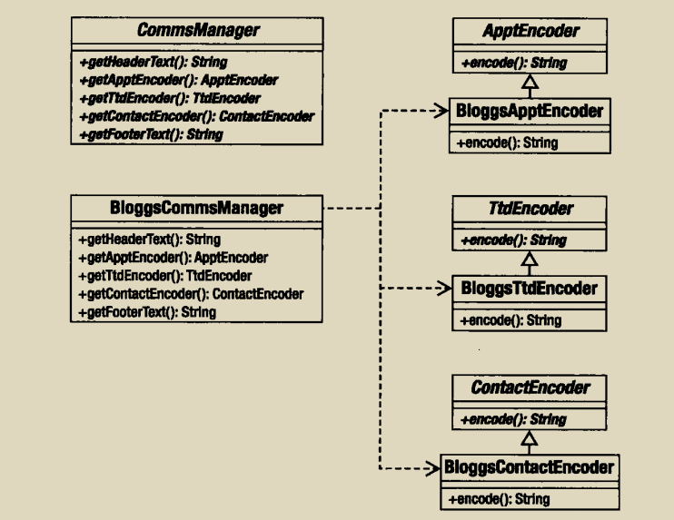
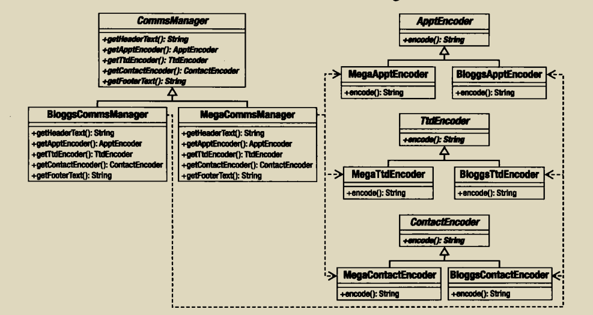
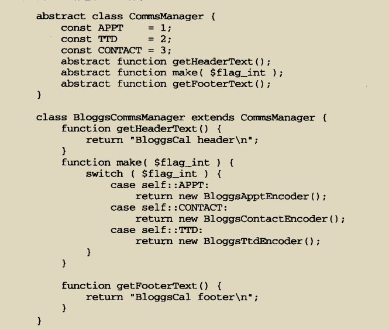

我们再来看之前事先的个人事务管理的例子，我们只有一种编码器，多种格式，我们通过加入更多的编码格式来使次此结构横向增长，但如何加入不同的编码器使系统纵向增长
由于一个编码器可以有多种格式，因此我们编码器类是抽象类，我们可以得出下面的结构，同时为了不判断来使用多态，创建者也是抽象类，

给每个编码器添加新的编码格式如下所示:

因为php不会强制规定方法的返回类型，我们可以使用判断来返回我们需要的对象，也就是我们经常看到的工厂模式的代码

具体代码不写了，参考工厂方法模式

抽象工厂模式带来以下好处:

- 将系统与实现的细节分离开来，可以添加任意数目的编码格式

- 对系统中功能相关的元素强制进行组合，通过使用BloggsCommsManager，可以确保只使用BloggsCal相关的类

缺点就是：

- 添加新编码器会令人苦恼，因为不仅要创建新产品的具体实现，而且也要修改抽象创建者和它的每一个具体实现

