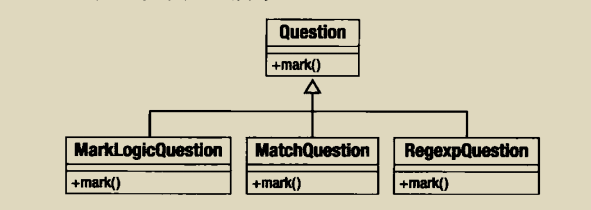
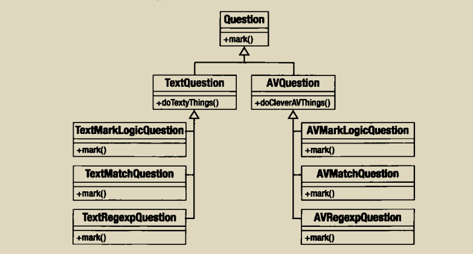
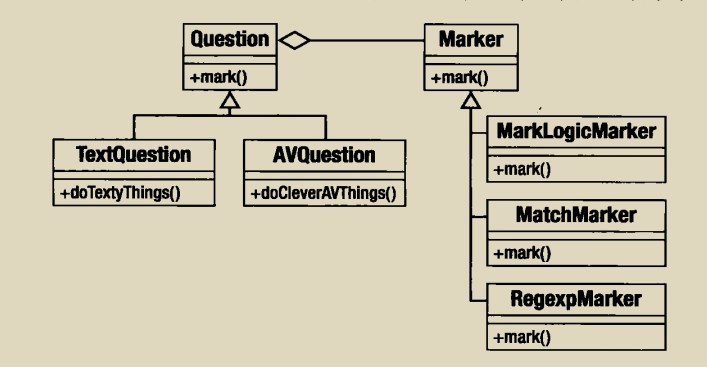

假设一个场景，假设用户回答问题时可以使用多种不同的标记方式，比如支持简单的MarkLogic语言，直接匹配以及正则表达式这3中标记方式，我们首先可能会想到使用子类来实现这些差异



但是，如果我们被要求支持不同类型的问题，基于文本的问题和支持多媒体的问题，在一个继承树中创建多个子类的方案会产生一些问题：


从图上我们可以看到，不仅需要在体系中创建大量的类，而且会造成代码重复，mark逻辑会在继承体系中的每个分支中重复出现。

使用策略这模式来来改造，当类必须支持同一个接口的多种实现时，最好的方法常常是提取出这些实现，并将它们放置在自己的类型中，而不是通过继承原有的类的去支持这些实现。



具体代码实现，可参考如下:

```php

abstract class Question {
    protected $promot;

    protected  $marker;

    function __construct($promot,Marker $marker)
    {
        $this->marker = $marker;
        $this->promot = $promot;
    }

    function mark($response) {
        return $this->marker->mark($response);
    }
}

class TextQuestion extends Question {
    //处理文本问题特有的操作
}

class AVQuestion extends Question {
    //处理语音问题特有的操作
}

abstract class Marker {
    protected $test;

    function __construct($test)
    {
        $this->test = $test;
    }

    abstract function mark($ressponse);

}

class MarkLoginMarker extends Marker {
    private $engine;

    function __construct($test)
    {
        parent::__construct($test);
    }

    function mark($ressponse)
    {
        return true;
    }

}

class MatchMarker extends Marker {
    function mark($response){
        return ($this->test==$response);
    }
}


class RegexMarker extends Marker {
    function mark($ressponse)
    {
        return (preg_match($this->test,$ressponse));
    }
}

//使用

$markers = [
    new RegexMarker("/f.ve/"),
    new MatchMarker("five"),
    new MarkLoginMarker('$input eques "five"')
    ];

foreach ($markers as $marker) {
    $question = new TextQuestion("how many beans make five",$marker);
    if ($question->mark($ressponse)) {
        print "well done\n";
    } else {
        print "never mind\n";
    }
}
```
