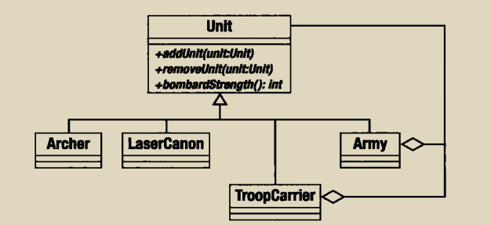
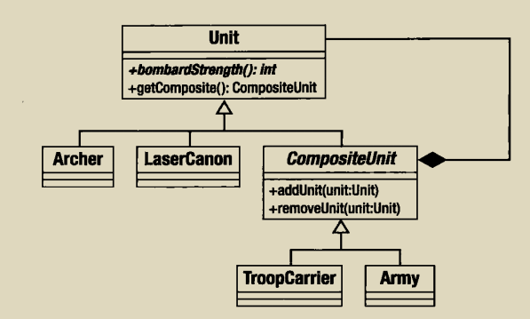

组合模式可以很好地聚合和管理许多相似的对象，至于是否相似，我们在抽象过程可以得到，这也是将继承用于组合对象的极端例子。
组合模式有以下特点：定义了一个单根继承体系，使具有截然不同职责的集合可以并肩工作，组合模式的类必须支持一个共同的操作集。





```php
<?php
/**
 * Created by PhpStorm.
 * User: seven
 * Date: 2019/1/17
 * Time: 21:50
 */

abstract class Unit {
    abstract function addUnit(Unit $unit);
    abstract function removeUnit(Unit $unit);
    abstract function bombarStrength();
}

class Army extends Unit {
    private $units =[];

    function addUnit(Unit $unit)
    {
        if (in_array($unit,$this->units,true)){
            return;
        }

        $this->units[] = $unit;
    }

    function removeUnit(Unit $unit)
    {
        $this->units = array_udiff($this->units,[$unit],function ($a,$b){return ($a===$b)?0:1;});
    }

    function bombarStrength()
    {
        $ret = 0;
        foreach ($this->units as $unit){
            $ret += $unit->bombarStrength();
        }
        return $ret;
    }
}

class TrropCarrier extends Unit {
    private $units =[];

    function addUnit(Unit $unit)
    {
        throw new Exception(get_class($this)."is a leaf");
    }

    function removeUnit(Unit $unit)
    {
        throw new Exception(get_class($this)."is a leaf");
    }

    function bombarStrength()
    {
       return 4;
    }
}

class Archer extends Unit {
    private $units =[];

    function addUnit(Unit $unit)
    {
        throw new Exception(get_class($this)."is a leaf");
    }

    function removeUnit(Unit $unit)
    {
        throw new Exception(get_class($this)."is a leaf");
    }

    function bombarStrength()
    {
        return 5;
    }
}

//创建一个Army对象
$main_army = new Army();

//添加一些unit对象

$main_army->addUnit(new Archer());
$main_army->addUnit(new TrropCarrier());

//创建一个新的Army对象

$sub_army = new Army();

//添加一些Unit对象
$sub_army->addUnit(new Archer());
$sub_army->addUnit(new Archer());
$sub_army->addUnit(new Archer());
$sub_army->addUnit(new Archer());

//第二个对象添加到第一个对象中去

$main_army->addUnit($sub_army);

print "attacking with strength {$main_army->bombarStrength()}";

```

但是，在使用这些unit，你会很没有安全感，生怕有一些没有定义addunit的会报错，因此我们需要对代码改造一下，如下所示：



具体代码实现如下:

```php
abstract class Unit {
    function getComposite(){
        return null;
    }
    abstract function bombarStrength();
}

abstract class CompositeUnit extends Unit {
    private $units =[];

    function getComposite()
    {
        return $this;
    }

    protected function units()
    {
        return $this->units;
    }

    function addUnit(Unit $unit)
    {
        if (in_array($unit,$this->units,true)){
            return;
        }

        $this->units[] = $unit;
    }

    function removeUnit(Unit $unit)
    {
        $this->units = array_udiff($this->units,[$unit],function ($a,$b){return ($a===$b)?0:1;});
    }
}
class Army extends CompositeUnit {
    private $units =[];

    function addUnit(Unit $unit)
    {
        if (in_array($unit,$this->units,true)){
            return;
        }

        $this->units[] = $unit;
    }

    function removeUnit(Unit $unit)
    {
        $this->units = array_udiff($this->units,[$unit],function ($a,$b){return ($a===$b)?0:1;});
    }

    function bombarStrength()
    {
        $ret = 0;
        foreach ($this->units as $unit){
            $ret += $unit->bombarStrength();
        }
        return $ret;
    }
}

class TrropCarrier extends CompositeUnit {
    private $units =[];

    function addUnit(Unit $unit)
    {
        throw new Exception(get_class($this)."is a leaf");
    }

    function removeUnit(Unit $unit)
    {
        throw new Exception(get_class($this)."is a leaf");
    }

    function bombarStrength()
    {
       return 4;
    }
}

class Archer extends Unit {

    function bombarStrength()
    {
        return 5;
    }
}

//调用

class UnitScript {
    static function joinExisting(Unit $newUnit,Unit $occupyingUnit){
        $comp= '';
        if (!is_null($comp = $occupyingUnit->getComposite())){
            $comp->addUnit($newUnit);
        }else{
            $comp = new Army();
            $comp->addUnit($occupyingUnit);
            $comp->addUnit($newUnit);
        }

        return $comp;
    }
}
```
