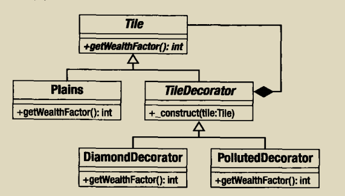

web应用要在返回响应给用户之前执行一系列操作，对用户的请求进行验证以及记录请求，也许还需要将请求中的原始输入处理成某种数据结构，最好必须执行核心操作。我们可以使用装饰模式来处理：




```php
<?php

class RequestHelper{}

abstract class ProcessRequest {
    abstract function process(RequestHelper $reg);
}

class MainProcess extends ProcessRequest {
    function process(RequestHelper $reg)
    {
        print __CLASS__.":doning something userful with request\n"
    }
}

abstract class DecorateProcess extends ProcessRequest {
    protected $processrequest;

    function __construct(ProcessRequest $pr)
    {
        $this->processrequest = $pr;
    }
}

class LogRequest extends DecorateProcess {
    function process(RequestHelper $reg)
    {
        print __CLASS__.":logging request\n";
        $this->processrequest->process($reg);
    }
}

class AuthenticateRequest extends DecorateProcess{
    function process(RequestHelper $reg)
    {
        print __CLASS__.":authenticating request\n";
        $this->processrequest->process($reg);
    }
}

class StructureRequest extends DecorateProcess {
    function process(RequestHelper $reg)
    {
        print __CLASS__.":structing request data\n";
        $this->processrequest->process($reg);
    }
}

//调用

$progress = new AuthenticateRequest(new StructureRequest(new LogRequest(new MainProcess())));

$progress->process(new RequestHelper());

//输出

AuthenticateRequest:authticating request
StructureRequest:structing request data
LogRequest:logging request
MainProcess:doning something userful with request
```