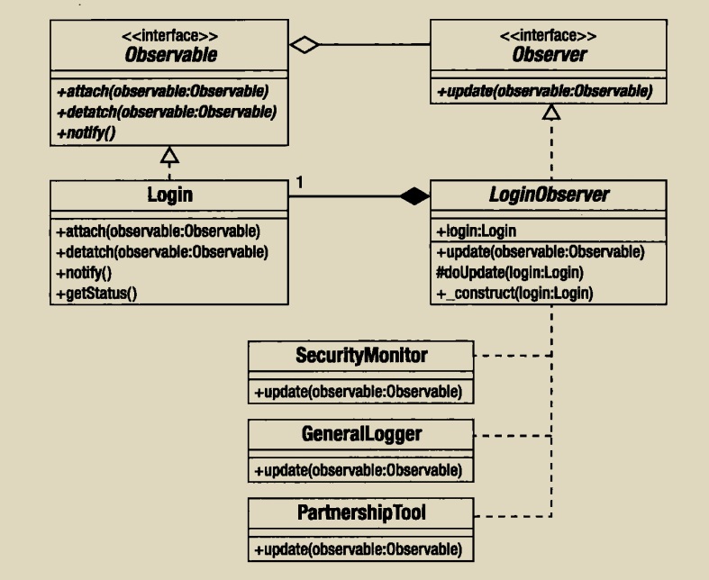

如果你对一个组件所做的改变会引起代码库其他地方的一连串改变，那么开发任务会很快编程一个产生bug和消除bug的恶性循环，那么你就应该更好好的来了解观察者模式了。
假设有一个负责处理用户登陆的类

```php
class Login {
    const LOGIN_USER_UNKNOWN =1;
    const LOGIN_WRONG_PASS =2;
    const LOGIN_ACCESS =3;
    private $status =[];

    function handleLogin($user,$pass,$ip){
        switch (rand(1,3)) {
            case 1:
                $this->setstatus(self::LOGIN_ACCESS,$user,$ip);
                $ret = true;
                break;
            case 2:
                $this->setStatus(self::LOGIN_WRONG_PASS,$user,$ip);
                $ret = false;
                break;
            case 3:
                $this->setStatus(self::LOGIN_USER_UNKNOWN,$user,$ip);
                $ret =false;
                break;
        }
    }

    private function setStatus($status,$user,$ip) {
        $this->status = [$status,$user,$ip];
    }
}
```

等我们开发完之后，可能陆陆续续会加功能，比如

加日志：

```php
function handleLogin($user,$pass,$ip){
        switch (rand(1,3)) {
            case 1:
                $this->setstatus(self::LOGIN_ACCESS,$user,$ip);
                $ret = true;
                break;
            case 2:
                $this->setStatus(self::LOGIN_WRONG_PASS,$user,$ip);
                $ret = false;
                break;
            case 3:
                $this->setStatus(self::LOGIN_USER_UNKNOWN,$user,$ip);
                $ret =false;
                break;
        }
        Logger::logIP($user,$ip,$this->getStatus());
        return $ret;
 }
```

用户登录失败发邮件

```php

if(!$ret){
    Notifier::mainWrning($user,$ip,$this->>getStatus());
}

```

以上都是非常容易满足的需求，但是直接在代码中加入工鞥来满足需求，Login类会紧紧嵌入到这个特殊的系统中，，如果其他需求需要login，但并不需要以上这些需求，我们可能就会复制出一个新的login类，但是如果后续需要加入一些功能的内容，我们会发现我们需要同步这两个类，而观察者模式就是来解决这种问题的


观察者模式核心就是把客户元素（观察者）从一个中心类（主体）中分离开来，当主体知道事件发生时，观察者需要被通知到，同时我们并不希望将主题与观察者之间的关系进行硬编码



我们可以允许观察者在主题上进行注册，具体代码实现如下:

```php
interface Observable {
    function attach(Observer $observer);
    function detach(Observer $observer);
    function notify();
}

class Login implements Observable
{
    private $observers;

    function __construct()
    {
        $this->observers = [];
    }

    function attach(Observer $observer)
    {
        $this->observers[] = $observer;
    }

    function detach(Observer $observer)
    {
        $newobservers = [];
        foreach ($this->observers as $obs) {
            if ($obs != $observer) {
                $newobservers[] = $obs;
            }
        }

        $this->observers = $newobservers;
    }

    function notify()
    {
        foreach ($this->observers as $obs) {
            $obs->update($this);
        }
    }

    function handleLogin($user, $pass, $ip)
    {
        switch (rand(1, 3)) {
            case 1:
                $this->setstatus(self::LOGIN_ACCESS, $user, $ip);
                $ret = true;
                break;
            case 2:
                $this->setStatus(self::LOGIN_WRONG_PASS, $user, $ip);
                $ret = false;
                break;
            case 3:
                $this->setStatus(self::LOGIN_USER_UNKNOWN, $user, $ip);
                $ret = false;
                break;
        }
        $this->notify();
        return $ret;
    }
}

interface Observer {
    function update(Observable $observable);
}

abstract class LoginObserver implements Observer {
    private $login;

    function __construct(Login $login)
    {
        $this->login = $login;
        $login->attach($this);
    }

    function update(Observable $observable)
    {
        if ($observable==$this->login){
            $this->doupdate($observable);
        }
    }

    abstract function doupdate(Login $login);
}

class SecurityiMonitor extends LoginObserver {
    function doupdate(Login $login)
    {
        $status = $login->getStatus();
        if ($status[0] == Login::LOGIN_WRONG_PASS){
            //发送邮件给管理员
        }
    }
}

class GernerallMonitor extends LoginObserver {
    function doupdate(Login $login)
    {
        $status = $login->getStatus();
        if ($status[0] == Login::LOGIN_WRONG_PASS){
            //记录数据
        }
    }
}

class PartnerMonitor extends LoginObserver {
    function doupdate(Login $login)
    {
        $status = $login->getStatus();
        if ($status[0] == Login::LOGIN_WRONG_PASS){
            //检查ip地址
        }
    }
}

//使用
$login = new Login();

new SecurityiMonitor($login);
new GernerallMonitor($login);
new PartnerMonitor($login);

```


因为php内置的SPL扩展提供了对观察者模式的原生支持，主要提供了SplObserver,SplSubject和SplObject-Storage
前两个都是借口，与之前的Oberver和Obervable接口完全相同，最后一个是一个工具类，用于更好地存储对象和删除对象，改进过的代码如下：

```php
class Login implements SplSubject
{
    private $storage;

    function __construct()
    {
        $this->storage = new SplObjectStorage();
    }

    function attach(SplObserver $observer)
    {
        $this->storage->attach($observer);
    }

    function detach(SplObserver $observer)
    {
       $this->storage->detach($observer);
    }

    function notify()
    {
        foreach ($this->observers as $obs) {
            $obs->update($this);
        }
    }

    function handleLogin($user, $pass, $ip)
    {
        switch (rand(1, 3)) {
            case 1:
                $this->setstatus(self::LOGIN_ACCESS, $user, $ip);
                $ret = true;
                break;
            case 2:
                $this->setStatus(self::LOGIN_WRONG_PASS, $user, $ip);
                $ret = false;
                break;
            case 3:
                $this->setStatus(self::LOGIN_USER_UNKNOWN, $user, $ip);
                $ret = false;
                break;
        }
        $this->notify();
        return $ret;
    }
}


abstract class LoginObserver implements SplObserver {
    private $login;

    function __construct(Login $login)
    {
        $this->login = $login;
        $login->attach($this);
    }

    function update(SplSubject $subject)
    {
        if ($subject==$this->login){
            $this->doupdate($subject);
        }
    }

    abstract function doupdate(Login $login);
}

class SecurityiMonitor extends LoginObserver {
    function doupdate(Login $login)
    {
        $status = $login->getStatus();
        if ($status[0] == Login::LOGIN_WRONG_PASS){
            //发送邮件给管理员
        }
    }
}

class GernerallMonitor extends LoginObserver {
    function doupdate(Login $login)
    {
        $status = $login->getStatus();
        if ($status[0] == Login::LOGIN_WRONG_PASS){
            //记录数据
        }
    }
}

class PartnerMonitor extends LoginObserver {
    function doupdate(Login $login)
    {
        $status = $login->getStatus();
        if ($status[0] == Login::LOGIN_WRONG_PASS){
            //检查ip地址
        }
    }
}

//使用
$login = new Login();

new SecurityiMonitor($login);
new GernerallMonitor($login);
new PartnerMonitor($login);

```