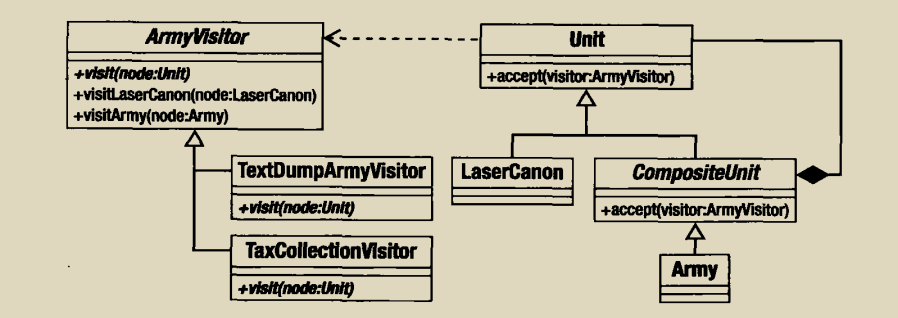

我们以组合模式的例子为基础讲起，如果我们需要统计树中单元个数的方法，该如何实现呢，因此工作的重点便是充分利用对象结构提供的轻松遍历的优势，但同时避免类过度膨胀
具体代码实现结构如下所示:




具体代码实现如下:

```php

abstract class Unit {
    protected $depth;

    function getComposite(){
        return null;
    }
    abstract function bombarStrength();

    function accept(ArmyVisitor $visitor) {
        $method = "visit".get_class($this);
        $visitor->$method($this);
    }

    protected function setDepth($depth) {
        $this->depth = $depth;
    }

    function getDepth() {
        return $this->depth;
    }
}

abstract class CompositeUnit extends Unit {
    private $units =[];

    function getComposite()
    {
        return $this;
    }

    protected function units()
    {
        return $this->units;
    }

    function addUnit(Unit $unit)
    {
        foreach ($this->units as $thisunit) {
            if ($unit === $thisunit) {
                return;
            }
            $unit->setDepth($this->depth+1);
        }

        $this->units[] = $unit;
    }

    function accept(ArmyVisitor $visitor)
    {
        parent::accept($visitor);
        foreach ($this->units as $thisunit){
            $thisunit->accept($visitor);
        }
    }

    function removeUnit(Unit $unit)
    {
        $this->units = array_udiff($this->units,[$unit],function ($a,$b){return ($a===$b)?0:1;});
    }
}

abstract class ArmyVisitor {
    abstract function visit(Unit $node);

    function visitArcher(Archer $node){
        $this->visit($node);
    }

    function visitCavalry(Cavalry $node) {
        $this->visit($node);
    }

    function visitArmy(Army $node) {
        $this->visit($node);
    }
}

class TextDumpArmyVisitor extends ArmyVisitor {
    private $text="";

    function visit(Unit $node)
    {
        $ret = '';
        $pad = 4*$node->getDepth();
        $ret .= sprintf("%{$pad}s","");
        $ret .=get_class($node);
        $ret .= "bombard:".$node->bombarStrength()."\n";
        $this->text .=$ret;
    }

    function getText() {
        return $this->text;
    }
}

class Army extends CompositeUnit {
    private $units =[];

    function addUnit(Unit $unit)
    {
        if (in_array($unit,$this->units,true)){
            return;
        }

        $this->units[] = $unit;
    }

    function removeUnit(Unit $unit)
    {
        $this->units = array_udiff($this->units,[$unit],function ($a,$b){return ($a===$b)?0:1;});
    }

    function bombarStrength()
    {
        $ret = 0;
        foreach ($this->units as $unit){
            $ret += $unit->bombarStrength();
        }
        return $ret;
    }
}

class TrropCarrier extends CompositeUnit {
    private $units =[];

    function addUnit(Unit $unit)
    {
        throw new Exception(get_class($this)."is a leaf");
    }

    function removeUnit(Unit $unit)
    {
        throw new Exception(get_class($this)."is a leaf");
    }

    function bombarStrength()
    {
        return 4;
    }
}

class Archer extends Unit {

    function bombarStrength()
    {
        return 5;
    }
}

//调用

$main_army = new Army();
$main_army->addUnit(new Archer());

$textdump = new TextDumpArmyVisitor();
$main_army->accept($textdump);
print $textdump->getText();

```

就这样，我们新创建了一种新的机制，现在只需添加几个方法，新功能就可以方便地添加到组合类中，，而不需要包含它们的接口，也不会产生大量重复的遍历代码
。但是，外部化操作可能破坏封装，也就是说，你可能需要公开被访问对象的内部来让访问者能对它们做任何有用的操作，例如，在第一个访问者例子中，为了给TextDumpArmyVisitor对象提供信息，我们被迫给Unit接口提供了一个额外的方法，其次，由于迭代与访问对象执行的操作是分离的，必须在一定程度上放开控制力度，比如，要创建一个在子节点迭代前后都能工作的visit（）方法不太容易，一个解决方法就是把迭代的职责转移到访问者对象上，但这样做的问题是可能在所有访问者中重复遍历代码
